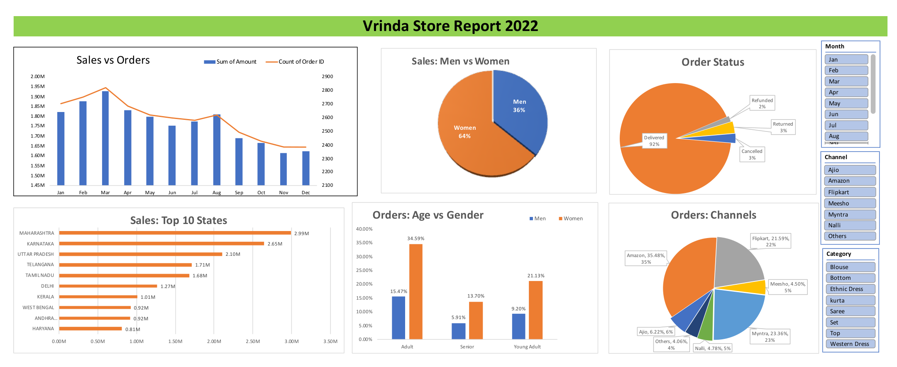

# 🛍️ Vrinda Store Sales Data Analysis (2022)

---

## Executive Summary  
This project analyzes Vrinda Store’s 2022 sales data to identify customer behavior, revenue drivers, and channel performance. Using Excel-based data cleaning, transformation, and pivot analysis, key insights were derived to support targeted growth strategies for 2023.  

The analysis shows that revenue is concentrated within a specific customer segment, limited regions, and a few dominant sales channels—highlighting opportunities for targeted marketing and expansion.

---

## 📊 Dashboard Overview  



---

## 📂 Project Structure  

```
Vrinda-Store-Analysis/
│
├── README.md
├── 01-raw-data.md
├── 02-analysis.md
├── 03-insights.md
├── 04-business-recommendations.md
│
├── data/
│   └── Vrinda Store Data Analysis.xlsx
│
├── dashboards/
│   └── Vrinda_Store_Data_Analysis_Report_2022.xlsx
│
└── images/
    ├── dashboard.png
    ├── gender-analysis.png
    └── state-analysis.png
```

---

## Business Problem  

Vrinda Store wants to create an annual sales report for 2022 to understand customer behavior better and improve sales in 2023.

### Key Questions:
- Compare sales and orders using a single chart  
- Identify the month with the highest sales and orders  
- Analyse purchasing behaviour (men vs women)  
- Evaluate order status distribution  
- Identify the top 10 contributing states  
- Analyse the relationship between age and gender  
- Identify top-performing sales channels  
- Determine the highest-selling product category  

---

## Methodology  

### Data Cleaning  
- Removed duplicates and inconsistencies  
- Verified data accuracy  
- Standardised formats  

### Data Processing  
- Created new columns:
  - `Age Group`  
  - `Month`  

### Data Analysis  
- Built Pivot Tables  
- Created charts for trend and segmentation analysis  
- Compared key metrics (sales, orders, demographics, channels)

### Insight Generation  
- Identified patterns in customer behaviour  
- Quantified contribution by segment  

---

## Skills

### Business Analysis
- Problem Structuring  
- KPI Definition & Tracking  
- Insight Generation & Recommendation  

### Data Analysis
- Data Cleaning & Preparation  
- Exploratory Data Analysis (EDA)  
- Trend Analysis  
- Customer Segmentation  
- Performance Analysis (Channel / Product-level)  

### Data Visualization & Reporting
- Dashboard Development (Microsoft Excel)  
- Report Structuring & Insight Communication  

### Tools & Technologies
- Microsoft Excel
  - Pivot Tables

---

## Results & Business Recommendation  

### Key Insights  

- **Demographics:** Women contribute **69.4%** of total orders (**64.0%** of total sales amount).
- **Geography:** Maharashtra, Karnataka, and Uttar Pradesh contribute **36.7%** of total sales.
- **Age Group:** The Adult age group (Ages 30–49) is the maximum contributor, accounting for **50.1%** of orders.
- **Channels:** Amazon, Flipkart, and Myntra are the maximum contributing channels, accounting for **80.4%** of sales.

---

### Business Recommendation  

**Target Segment:**  
- Focus marketing efforts primarily on **Women** aged **30–49** (Adults).

**Geographic Focus:**  
- Target top states, specifically expanding campaigns in:
  1. Maharashtra (14.12% Sales)
  2. Karnataka (12.50% Sales)
  3. Uttar Pradesh (9.94% Sales)

**Channel Strategy:**  
- Prioritize high-performing platforms: **Amazon**, **Flipkart**, and **Myntra**.

**Marketing Actions:**  
- Deploy personalized ads targeted at adult women.
- Launch platform-specific discount offers and coupons on Amazon, Flipkart, and Myntra.

---

### Key Observation  

Sales are heavily concentrated in a few segments, regions, and channels.  
This creates both:
- A strong optimisation opportunity  
- A potential business risk (over-dependence)

---

## 7. Next Steps  

### Short-Term  

- Design targeted ad campaigns for the identified customer segment  
- Optimise product listings (titles, images, pricing) on key platforms  

---

### Medium-Term  

- Test campaigns in underperforming states to evaluate expansion potential  
- Experiment with marketing strategies for male customers  

---

### Further Analysis (Future Scope)  

- Analyse customer behaviour patterns in more detail  
- Identify repeat purchase trends  
- Compare performance across different sales channels  
